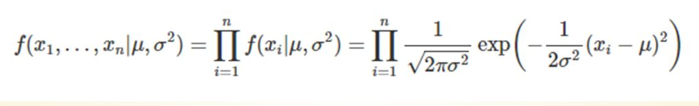
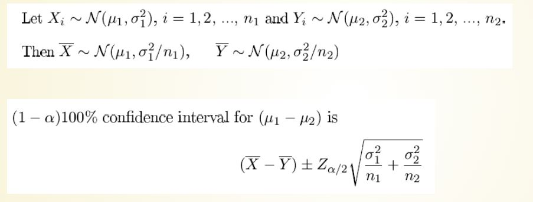
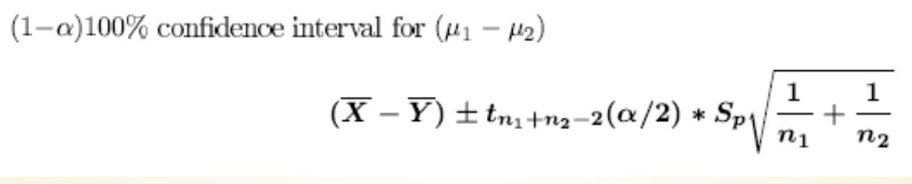
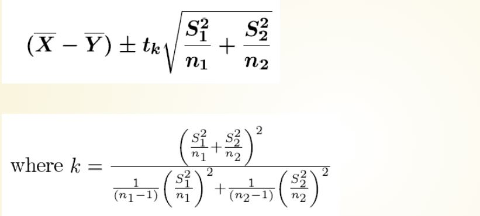
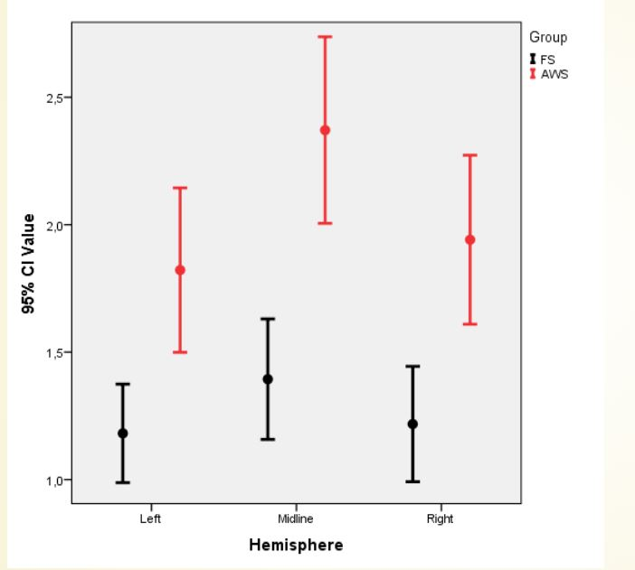

# POINT ESTIMATION & CONFIDENCE INTERVALS
------------------------------------------------------------------------
### Point Estimation

-   Parameter: Characteristics that are used to describe the population.

-   Statistic: a function of the observable random variables in a sample which does not include any unknown quantities.

-   Estimator: A statistic that is used to estimate an unknown parameter.
------------------------------------------------------------------------
### Point Estimation cont...

| Paramter                  | Estimator             |
|---------------------------|-----------------------|
| Population mean μ         | Sample mean x¯        |
| Population variance $σ^{2}$ | Sample variance $s^{2}$ |
| Population proportion p   | Sample proportion p   |
------------------------------------------------------------------------
### Maximum Likelihood Estimators

-   The point in the parameter space that maximizes the likelihood function.

-   Likelihood function is given by; $$
        L(x,θ)=∏i=1nf(xi,θ)
    $$

-   The idea of maximum likelihood estimation is to first assume our data come from a known family of distributions that contain parameters.

-   Then the maximum likelihood estimates (MLEs) of the parameters will be the parameter values that are most likely to have generated our data.
------------------------------------------------------------------------
### Normal Distribution - Maximum Likelihood Estimation

-   The MLE of μ is defined as `\(μ^MLE=argmax(x1,...,xn|μ,σ2)\)`, where `\(μ^MLE\)` is the value of μ that maximizes the likelihood function.



-   f we maximise the above likelihood function, we get `\(μ^MLE=x¯\)`.

-   Since the MLE of μ is the sample mean, computing the MLE in R becomes straightforward.
------------------------------------------------------------------------
### Interval Estimation

-   Point estimators are often use as sample measures for population parameters.

-   It is also helpful to know how reliable this estimate is, that is, how much sampling uncertainty is associated with it.

-   A useful way to express this uncertainty is to calculate an interval estimate or confidence interval for the population parameter

-   In other words, the confidence interval is of the form "**point estimate ± uncertainty**"
------------------------------------------------------------------------
### Confidence Interval for Mean

-   Case 1: When data is normal/ large sample and σ is known.

`$$x¯±z_{α/2}σ/√n$$` - Case 2: When data is normal/ large samples and σ is unknown.

`$$x¯±t_{n-1,α/2}σ/√n$$`

-   Case 3: When data is non-normal/ small samples

    -   For this, bootstrap approach is used as follows.
------------------------------------------------------------------------
### Confidence Intervals for Difference of Means

-   Case 1: Sampling from two independent normal distributions with known variances.



-   Case 2: Sampling from two independent normal distributions with unknown variances (small samples).

    -   when population variances are equal



```         
-   when population variances are unequal
```


------------------------------------------------------------------------
### Confidence Interval Charts


------------------------------------------------------------------------
### Confidenc Interval for Proportion

-   Case 1: For large sample (Using Normal approximation)


-   Case 1: For large sample (Using Binomial Distribution)

    -   we can use the following functions from R package epitools for this case.

-   Case 2: For small sample (Using Binomial Distribution)

    -   When sample size is small, confidence interval for population can be calculated using binom.test() function.
------------------------------------------------------------------------
### Confidence Intervals for Variance

-   Case 1: Under normality assumption

    -   User defined function to obtain confidence interval for variance.

-   Case 2: Under non-normality assumption

    -   When no assumption is made about data, a bootstrap method is used to obtain confidence intervals for the population variance.
