# Hypothesis Testing

-   Statistical hypothesis is an assumption or a statement which may or may not be true concerning one or more populations.

-   The purpose of hypothesis testing is to choose between two conflicting hypotheses about the value of a population parameter.

-   A hypothesis test involves two hypothesis:

    -   Null hypothesis (H0) : a statement to be tested (the case of "no effect" or "no change").

    -   The alternative hypothesis (HA): a statement that is an alternative to the null hypothesis.

-   The hypothesis test is aimed to test if the null hypothesis should be rejected in favor of the alternative hypothesis.

-   The criterion for deciding whether to reject the null hypothesis involves a so-called test statistic.
------------------------------------------------------------------------
### One Sample Test for Mean : When Population Variance is Known

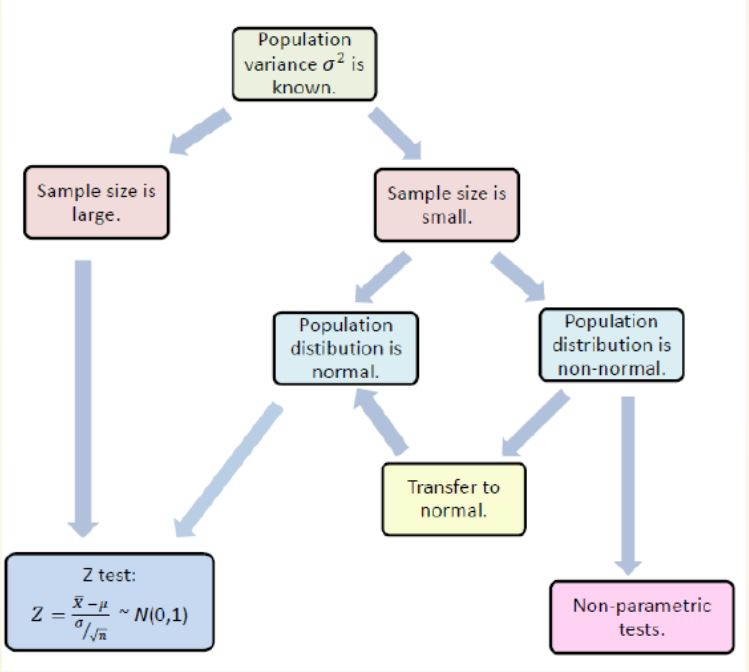
------------------------------------------------------------------------
### Z- Test

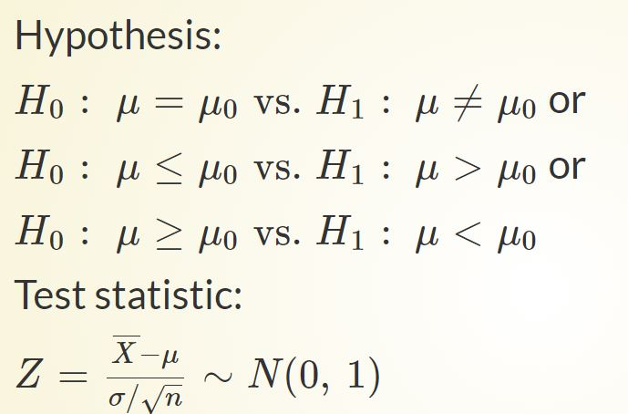
------------------------------------------------------------------------
### One Sample Test for Mean : When Population Variance is Unknown

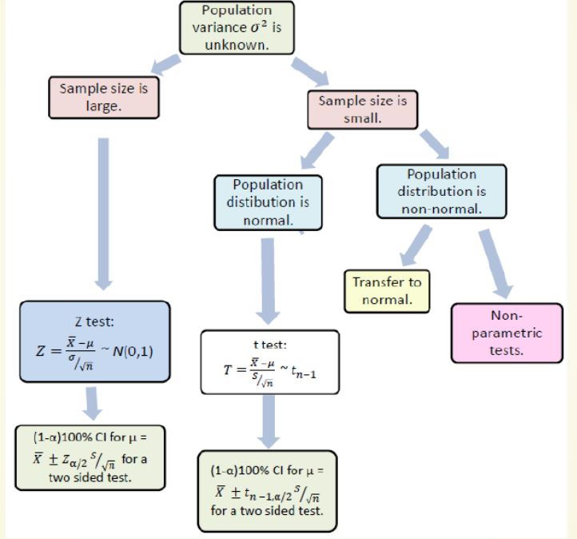
------------------------------------------------------------------------
### One Sample Proportion Test

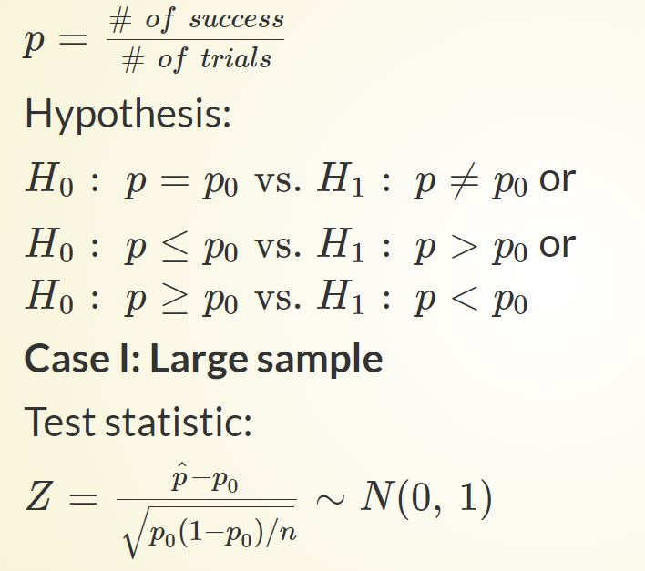
------------------------------------------------------------------------
### Check the Assumptions for Proportion Test

-   A simple random sample of size n is taken.

-   The conditions for the binomial distribution are satisfied.

-   To determine the sampling distribution of p\^, we need to show that np ≥ 5 and nq ≥ 5,

where q=1−p. If this requirement is true, then the sampling distribution of p\^ is well approximated by a normal curve.
------------------------------------------------------------------------
### Case II: Small Samples

-   In that case, the function binom.test() can be used for an exact calculation based on the binomial distribution
------------------------------------------------------------------------
### Hypothesis Testing for variance: One Sample

-   Let X be a random variable with variance σ2 and sample of size n

-   The hypotheses of the test are,

    -   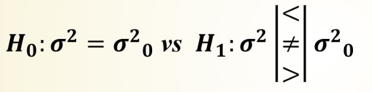

-   Under H0, Test statistic is,

    -   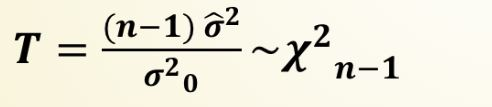

-   This test is valid only for normally distributed data.
------------------------------------------------------------------------
### Two Sample Test for Means

Case I: equal Variances

-   The hypotheses of the test are,

    -   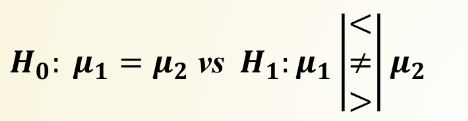

-   Under H0, Test statistic is,

    -   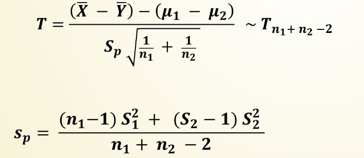
------------------------------------------------------------------------
### Case II: Uniqual Variances

-   Test statistics,
    -   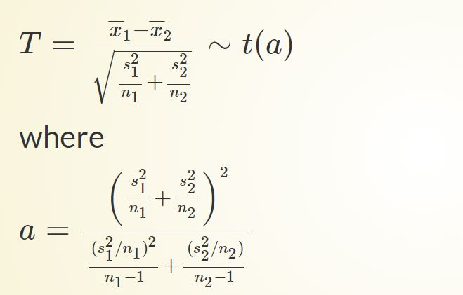
-   This test is valid for normally distributed variables X1 and X2 with unequal variance.
-----------------------------------------------------------------------

### Hypothesis Testing for Mean: Paired Samples

-   The hypotheses of the test are,

    -   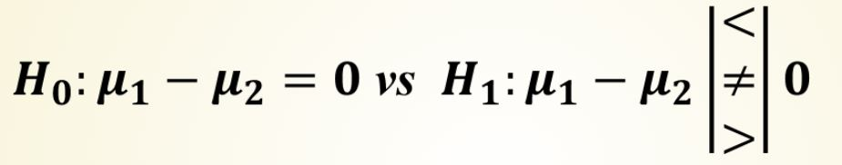

-   Under H0, Test statistic is,

    -   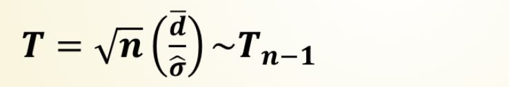

-   This test is valid only for normally distributed data or large samples (n \> 30).
------------------------------------------------------------------------
### Hypothesis Testing for Proportion: Two Samples

-   The hypotheses of the test are,

    -   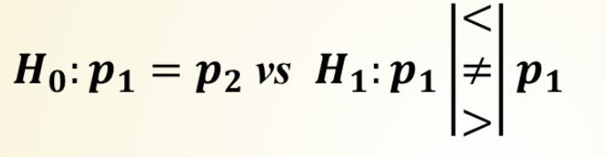

-   Under H0 Test statistic is,

    -   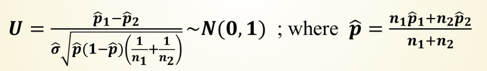

-   To use this test, the sample must be large enough.
------------------------------------------------------------------------
### Hypothesis Testing for Variance: Two Samples

-   The hypotheses of the test are,

    -   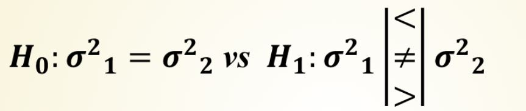

-   Under H0, Test statistic is,

    -   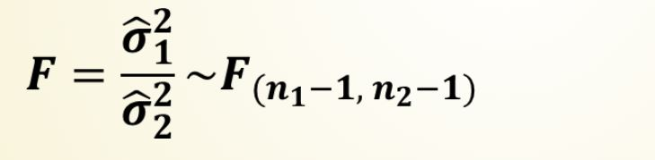

-   This test is valid only for normally distributed samples.
------------------------------------------------------------------------
### Check the Normality Assumptions

-   Shapiro-Wilk test

-   Anderson-Darling test

-   Kolmogorov-Smirnov test
------------------------------------------------------------------------
### Non - Parametric Tests

-   Non-parametric tests are distribution free.

-   The only assumption holds for these tests is that the data should be an independent random sample.

-   Examples:

    Tests on position- Sign test and Wilcoxon sign rank test
------------------------------------------------------------------------
### Sign Test

Case I: One sample

-   In this test we wish to compare the true median of a sample with a theoretical value.

    -   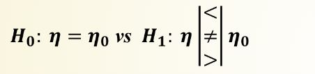

-   Test statistic:

    Two sided test : max(k+,k−), right sided test: k+ and left sided test: k−,

    where k+ is the number of values strictly greater than η0 and k− is the number of values strictly lower than η0.
------------------------------------------------------------------------
### Case II: Sign Test for Two Paired Samples

-   In this test we wish to compare the true median of two Paired samples

    

-   Test statistic:

    Two sided test : max(k+,k−), right sided test: k+ and left sided test: k−,

where k+ is the number of values strictly greater than η1−η2 and k− is the number of values strictly lower than η1−η2.
------------------------------------------------------------------------
### Wilcoxon Sign Rank Test

Case I: One Sample Sign Rank Test

-   This is an alternative test for sign test which uses not only the sign but also the rank difference into account.

    

-   Test statistic:

    Two sided test : min(τ+,τ−), right sided test: τ+ and left sided test: τ−,

where τ+ and τ− are the sum of ranks of positive and negative differences from η0.
------------------------------------------------------------------------
### Case II: Sign Rank Test for Two Paried Samples

-   The hypotheses for this test are;

    

-   Test statistic:

    Two sided test : min(τ+,τ−), right sided test: τ+ and left sided test: τ−,

where τ+ and τ− are the sum of ranks of positive and negative differences from η1−η2.
------------------------------------------------------------------------
### Case III: Sign Rank Test for Two Independent Sample

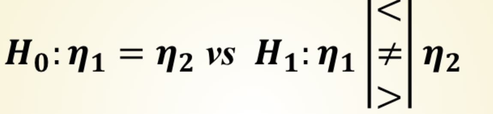
------------------------------------------------------------------------
### References

-   <https://www.youtube.com/watch?v=VK-rnA3-41c>

-   <https://rcompanion.org/handbook/>

-   <https://data-flair.training/blogs/hypothesis-testing-in-r/>

-   <http://www.r-tutor.com/elementary-statistics/hypothesis-testing>

-   <https://www.analyticsvidhya.com/blog/2021/07/hypothesis-testing-made-easy-for-the-data-science-beginners/>

-   [https://towardsdatascience.com/hypothesis-testing-for-data-scientists-everything-you-need-to-know-8c36ddde4cd2#](https://towardsdatascience.com/hypothesis-testing-for-data-scientists-everything-you-need-to-know-8c36ddde4cd2#:~:text=Hypothesis%20testing%20is%20a%20common,given%20a%20random%20data%20sample)
