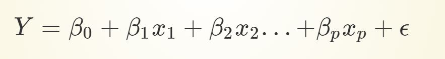
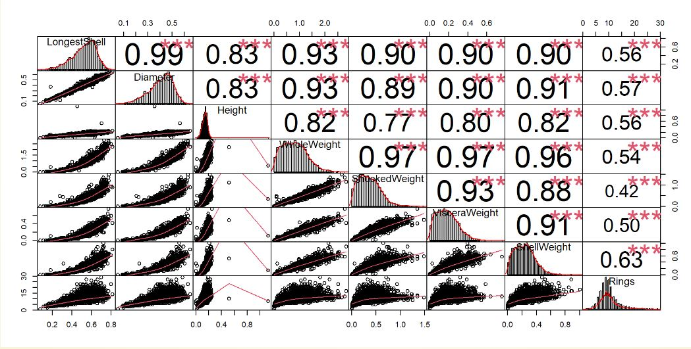
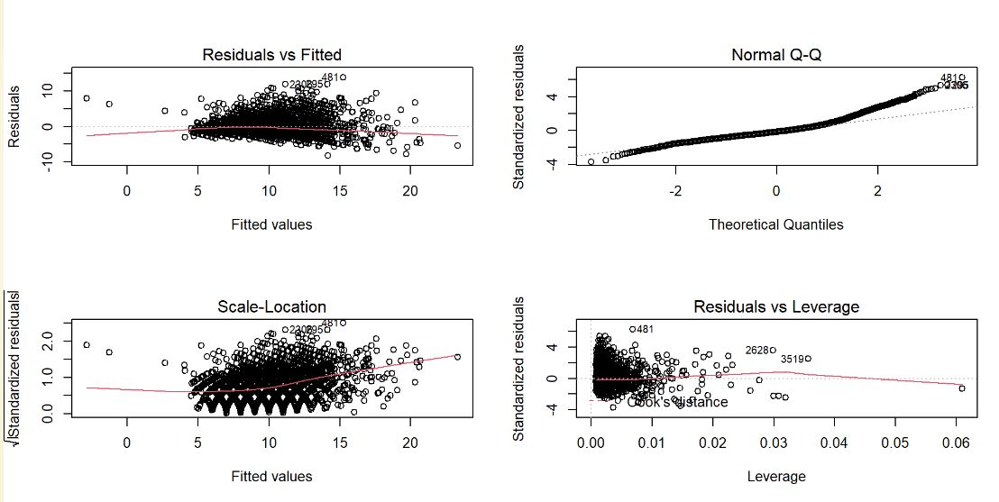
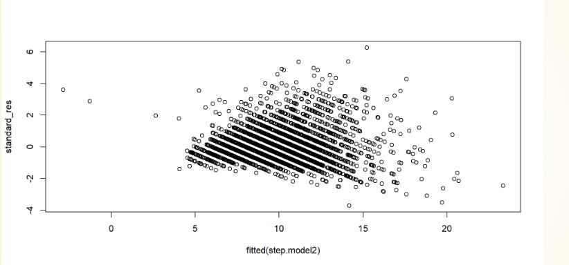
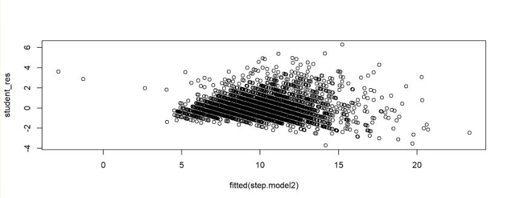
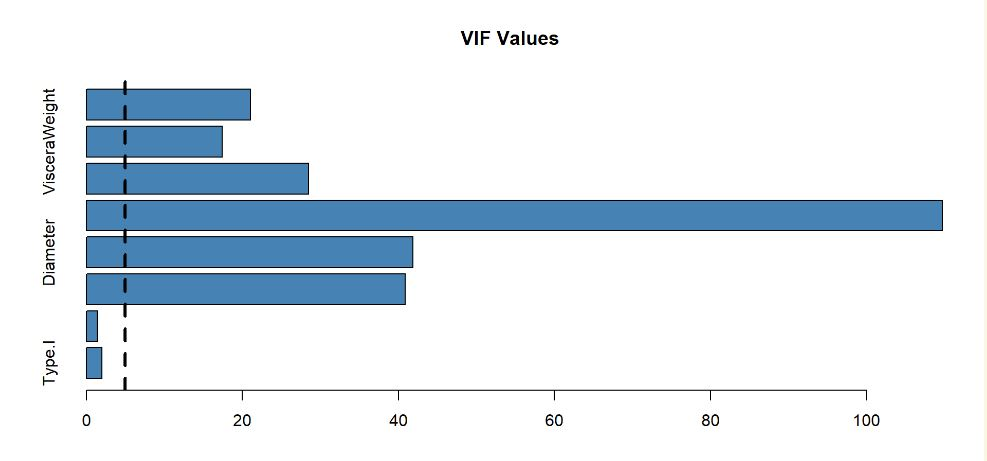

# MULTIPLE LINEAR REGRESSION

-   Studying the variation of Y(response variable) as a function of more than one X(explanatory) variables.

-   The general multiple linear regression model;

    

Where, ϵ∼N(0,σ2)s the random noise component of the model and `\(β0,β1,...,βp\)`, are the unknown parameters

### How to Fit a Multiple Linear Regression Model

**Steps you can follow:**

-   Graphical Interpretation

-   Parameter Estimation

-   Tests on Parameters

-   Analysis of Variance

-   Interpretation and Prediction

### Graphical Interpretation

-   Before fitting a multiple liner regression model, plot a scatterplot between every possible pair of variables.

-   It helps in visualizing the strength of relationships.

-   Can also be used for variable selection and identifying co-linearity.

    

### Parameter Estimation

-   Similar to the simple linear regression, we can use `lm()` function to estimate the unknown parameters \$β0,β1,.,βp\$.

### Methods of Building a Multiple Linear Regression Model

#### Backward Elimination

1.  Set a significance level for which data will stay in the model.

2.  Next, fit the full model with all possible predictors.

3.  Consider the predictor with the highest P-value. If the P-value is greater than the significance level, you'll move to step four, otherwise, you're done!

4.  Remove that predictor with the highest P-value.

5.  Fit the model without that predictor variable.

6.  Go back to step 3, do it all over, and keep doing that until you come to a point where even the highest P-value is \< SL.

#### Forward Selection

1.  Choose the significance level (SL = 0.05).

2.  Fit all possible simple regression models and select the one with the lowest P-value.

3.  Keep this variable and fit all possible models with one extra predictor added to the one you already have.

4.  Find the predictor with the lowest P-value. If P \< Sl, go back to step 3. Otherwise, you're done!

#### Stepwise Regression

1.  Select a significance level to enter and a significance level to stay.

2.  Perform the next step of forward selection where you add the new variable.

3.  Now perform all of the steps of backward elimination.

4.  Now head back to step two, then move forward to step 3, and so on until no new variables can enter and no new variables can exit.

### Model Diagnosis

-   The model fitting is just the first part of the regression analysis since this is all based on certain assumptions.

-   Regression diagnostics are used to evaluate the model assumptions and investigate whether or not there are observations with a large, undue influence on the analysis.

### Model Assumptions

Before using a regression model for interpreting the data, we must check that the model assumptions are met.

Basic assumptions of regression models:

-   Linearity of the data: The relationship between the predictor (x) and the outcome (y) is assumed to be linear.

-   Normality of residuals: The residual errors are assumed to be normally distributed.

-   Homogeneity of residuals variance: The residuals are assumed to have a constant variance (homoscedasticity)

-   Independence of residuals error terms

The diagnostic plots show residuals in four different ways:

1.  **Residuals vs Fitted**: to check the linear relationship assumptions.

2.  **Normal Q-Q**: to examine whether the residuals are normally distributed.

3.  **Scale-Location** (or Spread-Location): to check the homogeneity of variance of the residuals (homoscedasticity).

4.  **Residuals vs Leverage**: to identify extreme values that might influence the regression analysis.

### Identify Influential Outliers

-   An outlier is a point which is often distant from the others.

-   It is a point with a large value of its residual.

-   Different residual measures can be used to identify outliers.

    -   Standardised residuals

    -   Studentized residuals

    -   Cook's distance

### Standardised Residuals

-   Standardized residuals are "mostly" between 2 and 2, but they are dependent.

### Studentized Residuals

-   For an outlier the absolute values of its Studentized residual is greater than the 0.975th quantile of the Student distribution with n−p−2 degrees of freedom

### Cook's Distance

-   It is calculated by removing the i�th data point from the model and refitting the regression model.

-   It summarizes how much all the values in the regression model change when the i�th observation is removed.

-   The formula for Cook's distance is:

    

-   An R function to calculate Cook's distance is `cooks.distance()`.

### Checking Multicollinearity

-   It is a statistical terminology where more than one independent variable is correlated with each other.

-   Results in reducing the reliability of statistical inferences.

-   Hence, these variables must be removed when building a multiple regression model.

-   Variance inflation factor (VIF) is used for detecting the multicollinearity in a model.

### Model Selection

-   Model selection criteria refer to a set of exploratory tools for improving regression models.

-   Each model selection tool involves selecting a subset of possible predictor variables that still account well for the variation in the regression model's response variable.

-   This suggests that we need a quality criteria that considers the size of the model, since our preference is for small models that still fit well.

-   Several criteria are available to measure the performance of model. (AIC, BIC , `\(R^2\)`(Coefficient of determination), adjacent `\(R^2\)`)

### Useful Links

-   <https://www.youtube.com/watch?v=dQNpSa-bq4M>

-   <https://www.youtube.com/watch?v=zyEZop-5K9Q>

-   <https://datascienceplus.com/multicollinearity-in-r/>

-   <https://www.codingprof.com/3-ways-to-test-for-multicollinearity-in-r-examples/>
