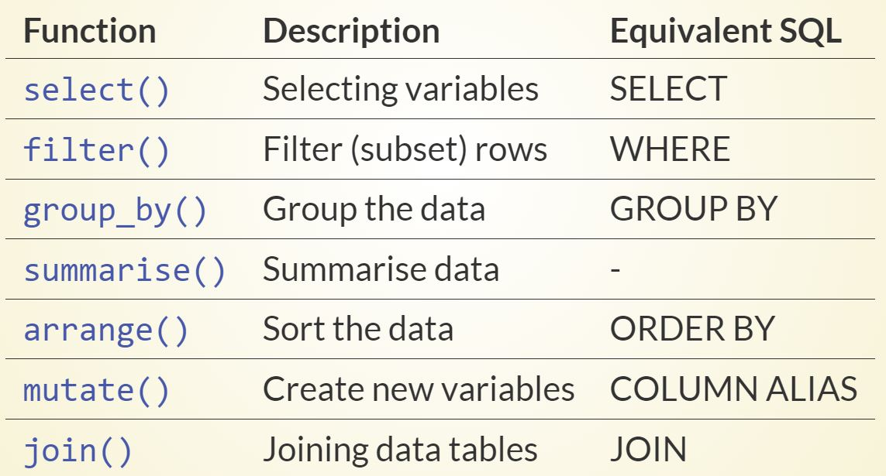
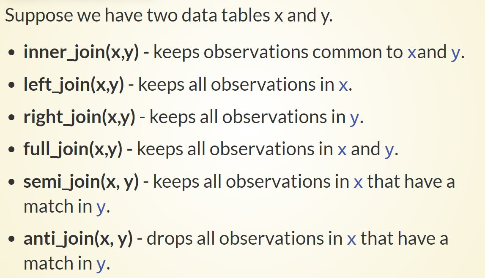

# DATA WRANGLING II
------------------------------------------------------------------------
### Data Manipulation with dpylr

-   The package dplyr was written by the most popular R programmer Hadley Wickham who has written many useful R packages.

-   The package contains a set of functions (or "verbs") that perform common data manipulation operations such as filtering for rows, selecting specific columns, re-ordering rows, adding new columns and summarizing data.

-   Hence, it is called a grammar of data manipulation.

-   
------------------------------------------------------------------------
### Relational Data

Suppose we have created data tables which are related to each other. These type of data tables are called relational data. When working with relational data we may want to combine information from different data tables. That can be done in different ways using `dplyr` package.

This concept is similar to the *relational* database management system (or `RDBMS`) using `SQL`. Using R, we can do this by using `dplyr` package, which is somewhat easier to use than `SQL`, since `dplyr` is specialised to do data analysis.

------------------------------------------------------------------------
### Useful Links

-   [Data Carpentry](http://datacarpentry.org/), 2017-2018, `dplyr` package, <https://datacarpentry.org/R-genomics/04-dplyr.html#data_manipulation_using_dplyr>

-   dplyr : <https://dplyr.tidyverse.org/>

-   dplyr tutorial : <https://www.listendata.com/2016/08/dplyr-tutorial.html>

-   Data with dplyr : <https://econ.suffolk.edu/dplyr/>

-   dplyr flipbook: <https://econ.suffolk.edu/slides/dplyr-summarize/#1>

-   R for Data Science: <https://r4ds.had.co.nz/relational-data.html>
